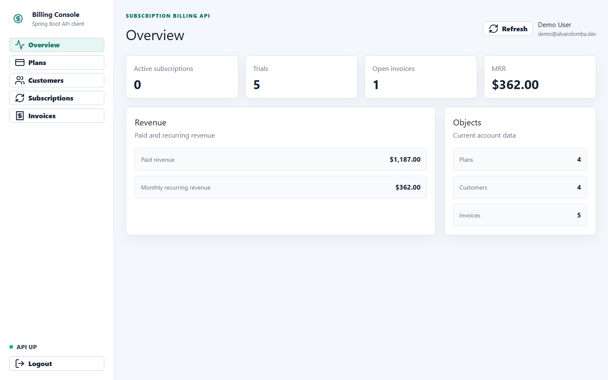
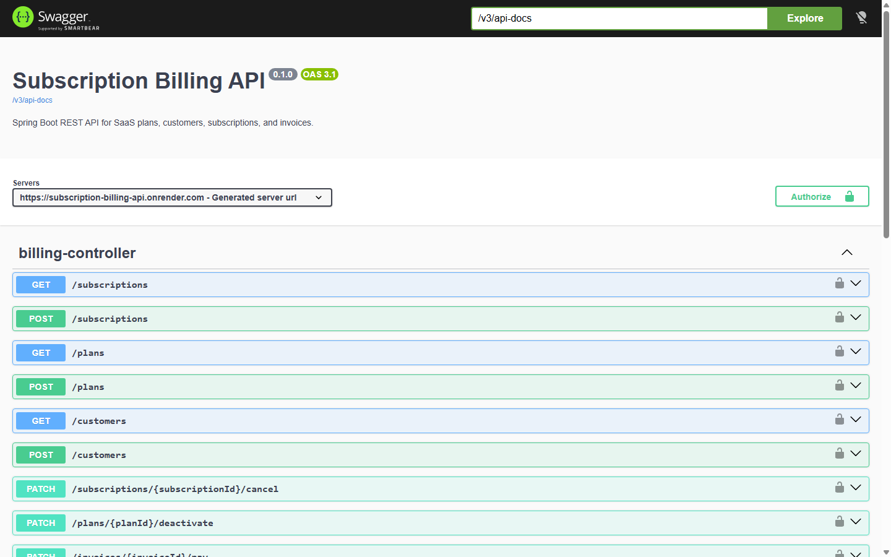
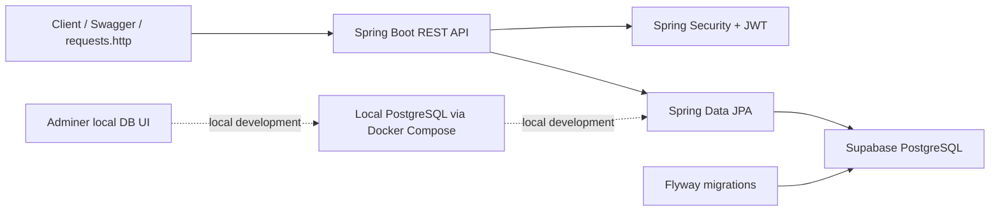
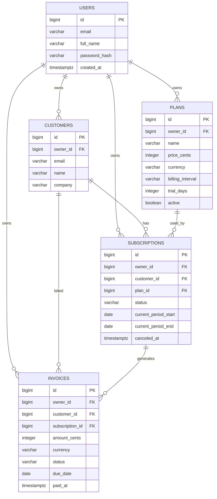

# Subscription Billing API

[](https://github.com/alvarolomba/subscription-billing-api/actions/workflows/ci.yml)


Production-style Spring Boot backend for a SaaS billing system. The API manages users, pricing plans, customers, subscriptions, invoices, and billing metrics with JWT authentication, PostgreSQL persistence, Flyway migrations, Docker, OpenAPI docs, and integration tests.

## Overview

This project demonstrates a backend service that looks and behaves like a small slice of a real SaaS billing platform. The API can be tested through Swagger, the included request collection, or the deployed React dashboard.

Quick review path:

1. Open the public Swagger UI.
2. Register and log in.
3. Create a plan and customer.
4. Create a subscription.
5. Pay the generated invoice.
6. Read billing stats.

## Live Demo

- React dashboard: [https://subscription-billing-dashboard.vercel.app](https://subscription-billing-dashboard.vercel.app)
- Frontend repository: [https://github.com/alvarolomba/subscription-billing-dashboard](https://github.com/alvarolomba/subscription-billing-dashboard)
- Render API: [https://subscription-billing-api.onrender.com](https://subscription-billing-api.onrender.com)
- Swagger UI: [https://subscription-billing-api.onrender.com/swagger-ui.html](https://subscription-billing-api.onrender.com/swagger-ui.html)
- Health check: [https://subscription-billing-api.onrender.com/actuator/health](https://subscription-billing-api.onrender.com/actuator/health)

## Demo Access

Use this shared account to explore the deployed dashboard with preloaded plans, customers, subscriptions, invoices, and billing metrics:

```text
Email: demo@alvarolomba.dev
Password: DemoPassword123!
```

This account contains demo data only. You can also register a new account from the dashboard or Swagger.

## Demo Availability

The API is hosted on Render's free tier, so the first request after a period of inactivity may be slower due to a cold start.

## Preview

### React Dashboard



### Swagger UI



## What This Demonstrates

- Secure REST API design with JWT bearer authentication.
- User-owned data isolation across plans, customers, subscriptions, and invoices.
- Relational modelling with PostgreSQL and explicit Flyway migrations.
- Billing lifecycle logic: create subscription, generate invoice, pay invoice, cancel subscription.
- Production-minded defaults: Dockerized local dev, health checks, OpenAPI docs, validation, tests.
- Production deployment with the API on Render and managed PostgreSQL on Supabase.

## Tech Stack

- Java 17
- Spring Boot 4
- Spring Web MVC
- Spring Security
- Spring Data JPA
- PostgreSQL
- Supabase PostgreSQL for the deployed database
- Flyway
- JWT
- Swagger UI / OpenAPI
- Maven
- Docker Compose
- Adminer for local database inspection
- Testcontainers for PostgreSQL-backed integration tests

## Architecture



## Deployment

The public API runs on Render:

```text
https://subscription-billing-api.onrender.com
```

The deployed database is Supabase PostgreSQL. Render stores the Supabase connection string in the `DATABASE_URL` environment variable, which is intentionally not committed to the repository.

Runtime architecture:

```text
React dashboard / Swagger / API client -> Render web service -> Supabase PostgreSQL
```

Local development still uses Docker Compose with a local PostgreSQL container and Adminer.

## Data Model



## Local Development

Start the API, PostgreSQL, and Adminer:

```powershell
docker compose up -d --build
```

Local URLs:

| Tool | URL |
| --- | --- |
| API | `http://localhost:8080` |
| Swagger UI | `http://localhost:8080/swagger-ui.html` |
| Health check | `http://localhost:8080/actuator/health` |
| Adminer | `http://localhost:8081` |

Adminer login:

| Field | Value |
| --- | --- |
| System | `PostgreSQL` |
| Server | `db` |
| Username | `billing` |
| Password | `billing` |
| Database | `billing` |

Stop containers:

```powershell
docker compose stop
```

Remove containers but keep the database volume:

```powershell
docker compose down
```

Remove containers and local database data:

```powershell
docker compose down -v
```

## API Endpoints

| Method | Endpoint | Description |
| --- | --- | --- |
| `GET` | `/actuator/health` | Service health check |
| `POST` | `/auth/register` | Create a user |
| `POST` | `/auth/login` | Get a JWT token |
| `GET` | `/auth/me` | Read current authenticated user |
| `GET` | `/plans` | List plans |
| `POST` | `/plans` | Create a plan |
| `PATCH` | `/plans/{planId}/deactivate` | Deactivate a plan |
| `GET` | `/customers` | List customers |
| `POST` | `/customers` | Create a customer |
| `GET` | `/subscriptions` | List subscriptions |
| `POST` | `/subscriptions` | Create a subscription and first invoice |
| `PATCH` | `/subscriptions/{subscriptionId}/cancel` | Cancel a subscription |
| `GET` | `/invoices` | List invoices |
| `PATCH` | `/invoices/{invoiceId}/pay` | Mark an invoice as paid |
| `GET` | `/billing/stats` | Read billing metrics |

## Example Flow

The full flow is available in [requests.http](requests.http):

1. Register a user.
2. Log in and copy the `accessToken`.
3. Set `@token` in `requests.http`.
4. Create a plan.
5. Create a customer.
6. Create a subscription.
7. List invoices.
8. Pay the first invoice.
9. Read billing stats.

## Project Presentation

- Demo script: [`docs/demo-script.md`](docs/demo-script.md)
- Technical notes and trade-offs: [`docs/technical-notes.md`](docs/technical-notes.md)

## Tests

Run the integration test suite:

```powershell
mvn test
```

The tests cover:

- user registration and login
- duplicate email rejection
- authenticated billing flow
- invoice payment and billing stats
- cross-user data isolation
- unauthenticated request rejection
- Flyway migrations and JPA schema validation against PostgreSQL via Testcontainers

## Kubernetes

Example Kubernetes manifests live in [`k8s/`](k8s). They show how the API can run behind a ClusterIP service with health probes and secret-based configuration.

These manifests are intentionally minimal. They assume an external PostgreSQL instance or a separately managed in-cluster database.

## How This Maps To Real SaaS Billing Systems

This is not a payment processor clone. It focuses on the backend primitives that appear in real SaaS billing platforms:

- tenants own their customers, plans, subscriptions, and invoices
- subscription creation creates a first invoice
- invoices move through explicit states
- reporting endpoints expose MRR and paid revenue
- schema changes are migration-driven instead of generated implicitly
- tests run against PostgreSQL to catch database-specific issues early

## Production Considerations

- Database credentials are injected through environment variables and are not committed to the repo.
- The portfolio demo uses a stable JWT signing key so tokens remain valid across Render redeploys; a real production deployment should inject this as a secret.
- Render runs the API container; Supabase provides the managed PostgreSQL database.
- Flyway owns schema creation; Hibernate validates the schema instead of creating it.
- The API accepts PostgreSQL URLs from managed providers and converts them to JDBC URLs at startup.
- Supabase Row Level Security is enabled on application tables with backend-only policies. The frontend does not access Supabase directly; all data access goes through the Spring Boot API.
- Integration tests use Testcontainers with PostgreSQL instead of H2.
- The free Render plan can sleep after inactivity, causing cold starts on the first request after idle time. This is acceptable for a portfolio demo but should be replaced with an always-on paid instance for production or live recruiter demos.
- Next production improvements would include refresh tokens, rate limiting, structured logs, request tracing, and CI-backed deploy promotion.

## Summary

Built a production-style SaaS billing backend with Spring Boot, PostgreSQL, Flyway, JWT authentication, Docker, OpenAPI documentation, Render deployment, and integration tests. Implemented subscription lifecycle logic, invoice payments, per-user authorization, and billing metrics.
