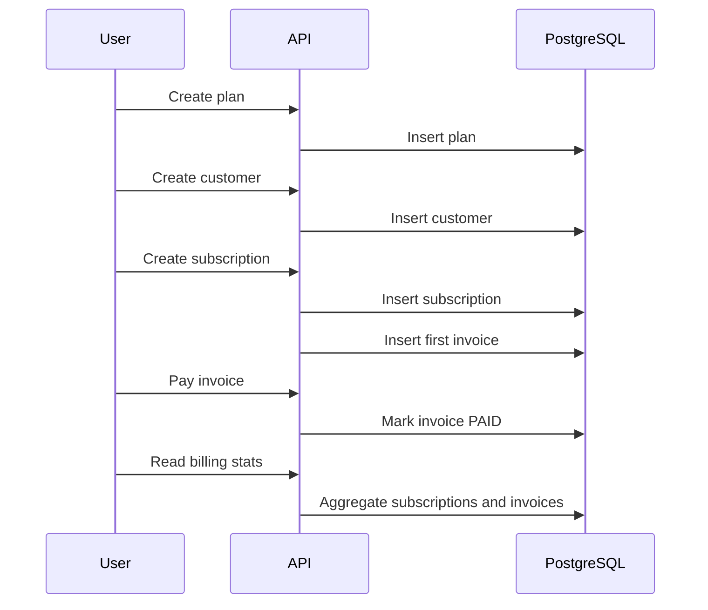

# Technical Notes

## Key Design Choices

- Money is represented as integer cents instead of floating-point values.
- JWT is used for stateless authentication.
- Each business table stores `owner_id` to enforce per-user data isolation.
- Flyway owns schema creation and Hibernate runs in `validate` mode.
- Integration tests run against PostgreSQL via Testcontainers.
- Docker Compose includes Adminer so the local database can be inspected without extra setup.

## Main Business Flow

## Trade-Offs

- The project does not integrate Stripe because the goal is to demonstrate backend primitives rather than depend on a third-party payment processor.
- Refresh tokens are not included yet; access tokens are enough for the current project scope.
- The current billing cycle logic is intentionally small and understandable.
- Render free tier is useful for public demos, but it can sleep after inactivity.

## Next Iterations

- Add refresh tokens.
- Add pagination and filtering.
- Add Stripe-style webhook ingestion.
- Add subscription renewal job.
- Add structured logging and request tracing.
